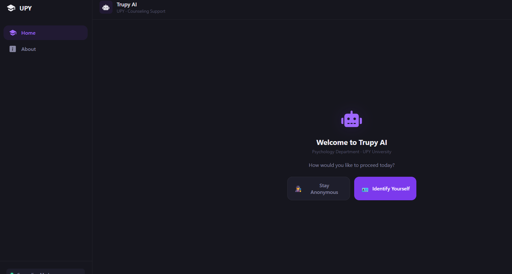
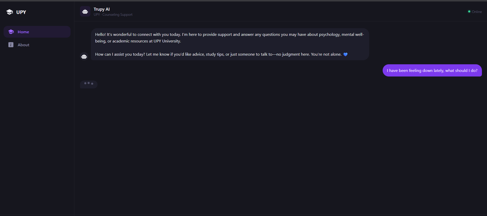

<h1 align="center">Trupy AI</h1>

<!-- Badges -->
<p align="center">
  
  
  
  
  
</p>

Trupy AI is an AI-powered chatbot developed for the Psychology Department of UPY University. This project served as the capstone for the Software Engineering course. Trupy AI acts as a virtual companion for students, providing a safe and supportive space to discuss psychology and mental well-being topics.

## Demo






## Features

### Frontend
- **Responsive Two-Column Layout**: Dynamic sidebar and workspace architecture optimized for desktop, tablet, and mobile devices.
- **Onboarding Workflow**: Customizable welcome experience offering "Stay Anonymous" or "Identity" modes to respect student privacy.
- **Reactive Chat Interface**: Real-time messaging with smooth transitions, typing indicators, and auto-scrolling powered by Vue 3.
- **Modern Design System**: A premium dark-theme UI utilizing `Composition API`, `oh-vue-icons`, and custom CSS variables.

### Backend
- **Asynchronous API**: High-performance FastAPI backend designed for low-latency session and chat processing.
- **Session Persistence**: Redis-integrated state management to maintain conversational context and session recovery.
- **Safety & Crisis Protocols**: Intelligent keyword monitoring to identify urgent student concerns and provide appropriate routing.
- **Flexible LLM Integration**: OpenAI-compatible endpoint support for seamless integration with local or cloud-based Large Language Models.

## Getting Started

### Prerequisites

- [Docker](https://www.docker.com/)
- [Git](https://git-scm.com/)
- DeepSeek API key (or API key from your chosen AI provider compatible with the OpenAI library)
    - For development I used Docker Model Runner, a technology developed by Docker forrunning and testing AI models locally. You can find more information about it here: [Docker Model Runner](https://docs.docker.com/ai/model-runner/).


### Installation & Setup (with Docker)

1. **Clone the repository:**
	```bash
	git clone <repository-url>
	cd trupy_assistant
	```

2. **Copy environment variable files:**
	```bash
	cp backend/.env.example backend/.env
	# Edit backend/.env as needed
	```
    - Add your API key to the `.env` file in the backend directory. You can obtain an API key from OpenAI or your chosen AI provider. It must be compatible witht the OpenAI library.

3. **Start all services using Docker Compose:**
	```bash
	docker-compose up --build
	```

This will build and start the backend (FastAPI + Redis + SQLite) and frontend (Vue.js) services.

## Usage


Once Docker Compose is running:

- The backend API will be available at [http://localhost:8000](http://localhost:8000)
- The frontend app will be available at [http://localhost:5173](http://localhost:5173)

To stop the services without removing volumes, press `Ctrl+C` in the terminal and run:
```bash
docker-compose down
```

To stop the services and remove volumes (data will be lost), run:
```bash 
docker-compose down -v
```

## Future Work / Roadmap

- User authentication and authorization
- Expanded conversational abilities and context awareness
- Integration with university resources (e.g., appointment booking, resource links)
- Analytics dashboard for usage statistics
- Improved UI/UX and accessibility


